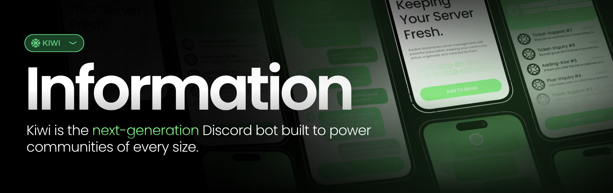

👋 Heya, welcome to the kiwi bot development group; Home of the kiwi bot. 
This is where we store our repositories that we use in out project, 
including open source repositories (which follows LGPL v3.)

This is currently the home of:
* WindUI *(Closed Off - Under Construction.)*
  > Our component library and design language, which will be used for
    the website and dashboard. Any one can use and improve it, and we
    may accept pull requests.

## FAQ
We've been asked these questions before or we think that it may be useful
to add answers to likely questions here before we *inevitably* get asked them.

### Will Kiwi Be Open-Sourced?
No, only segments of the project will be, such as WindUI. This protects
us and allows the project to keep going so we can support our users in the
long term.

### How Can I Contribute?
You can freely contribute to our open-source libraries whenever you want,
we'll be willing to accept pull requests that improve our project.

To contribute to our core components, you can keep a [look out for 
developer positions in our discord](https://kiwibot.dev/discord).

### Is The Bot Free?
In the meantime, Kiwi will be free to use for a limited time under the *BETA programme* as we develop
its features. Once the bot is ready for a full release, we will move to a
paid model.

